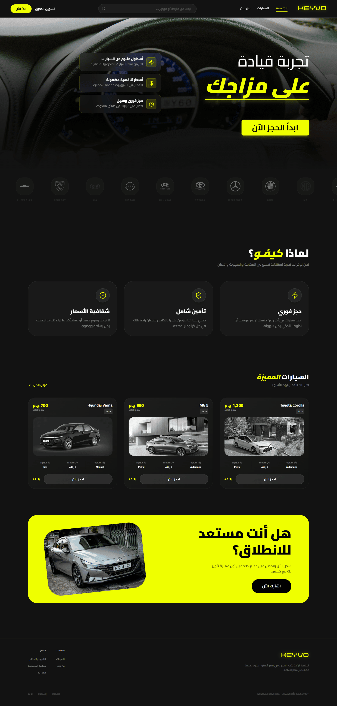
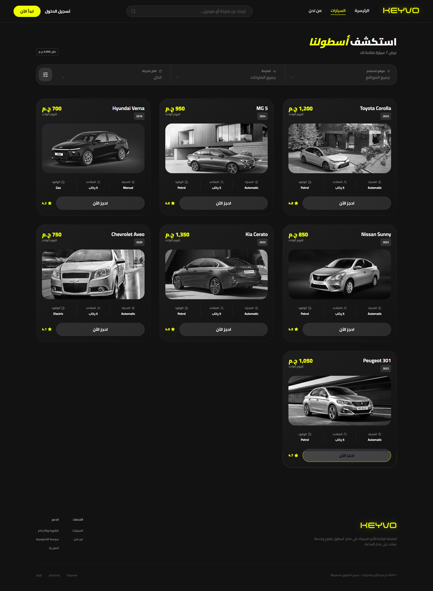
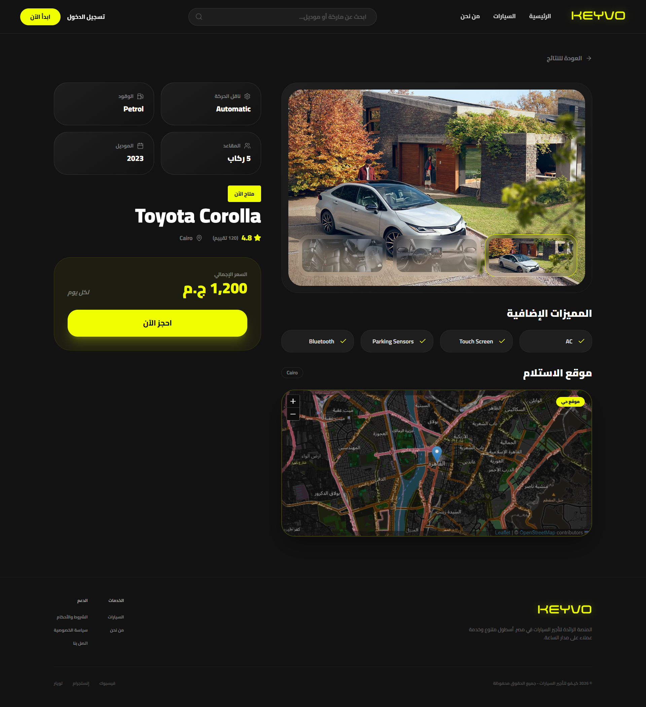
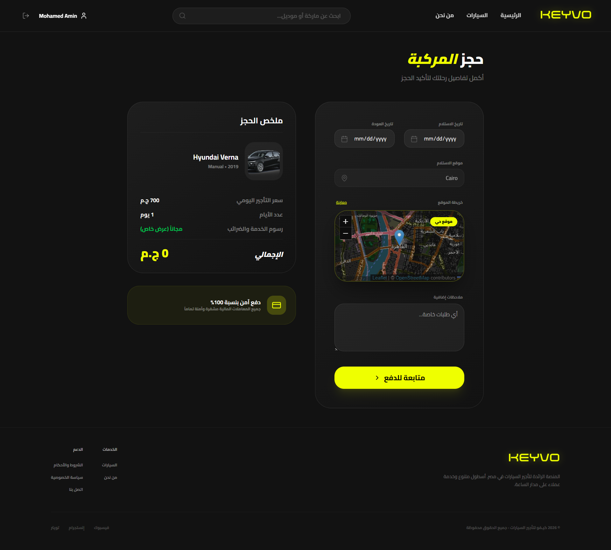
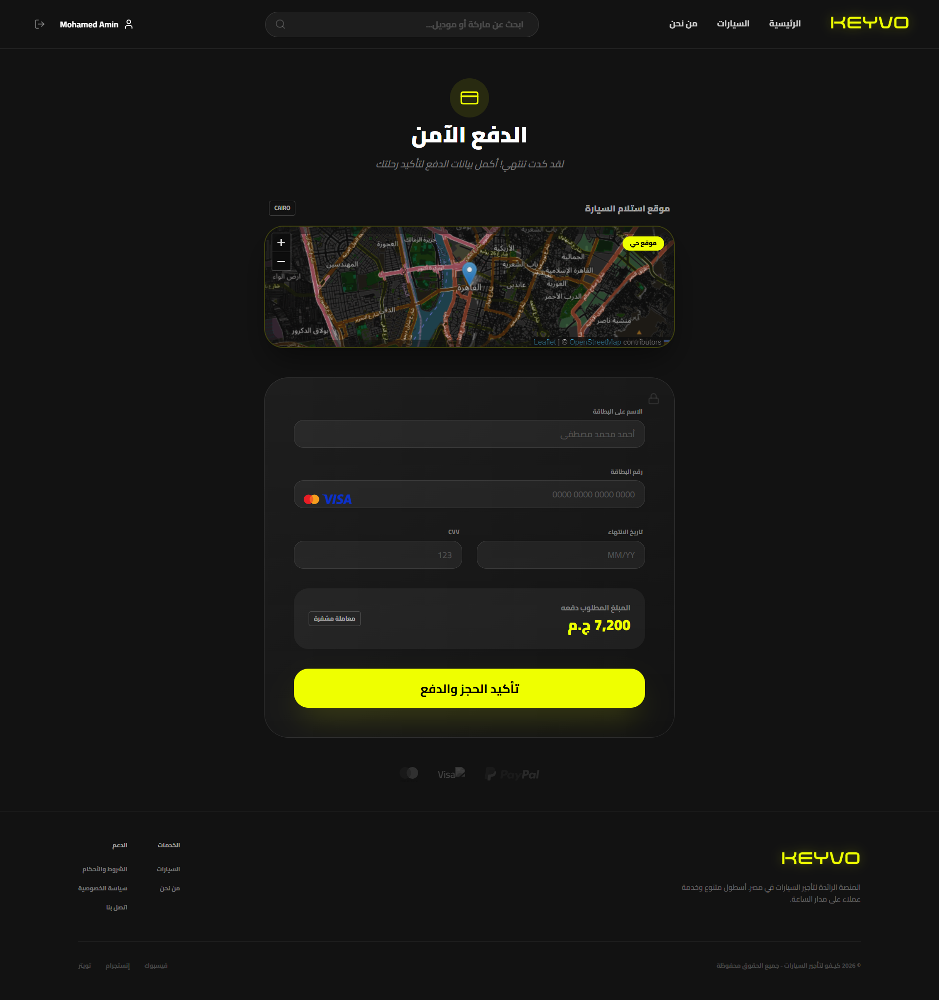
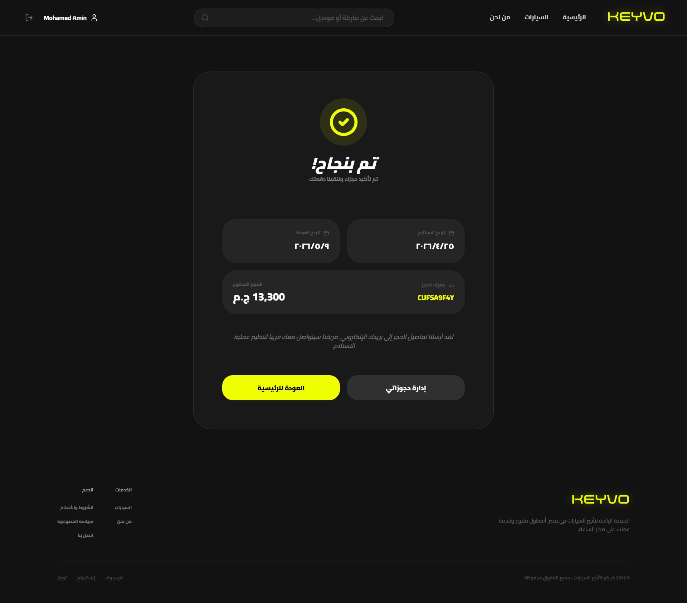
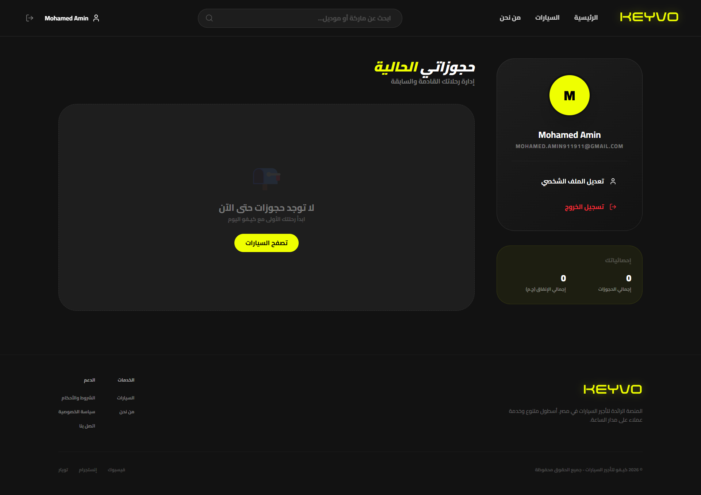
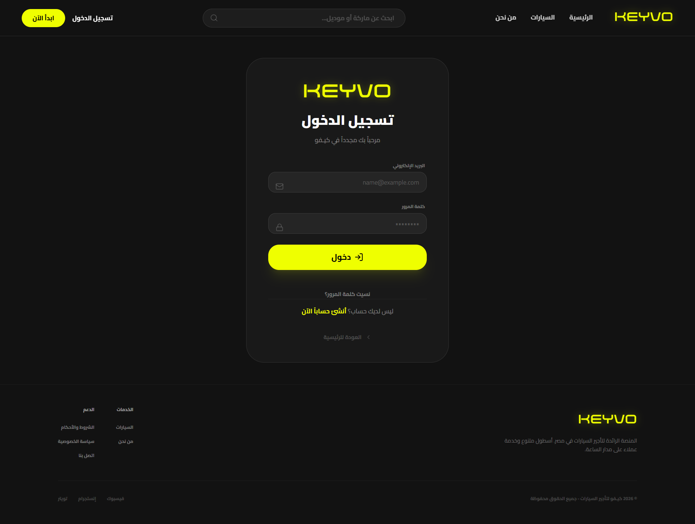
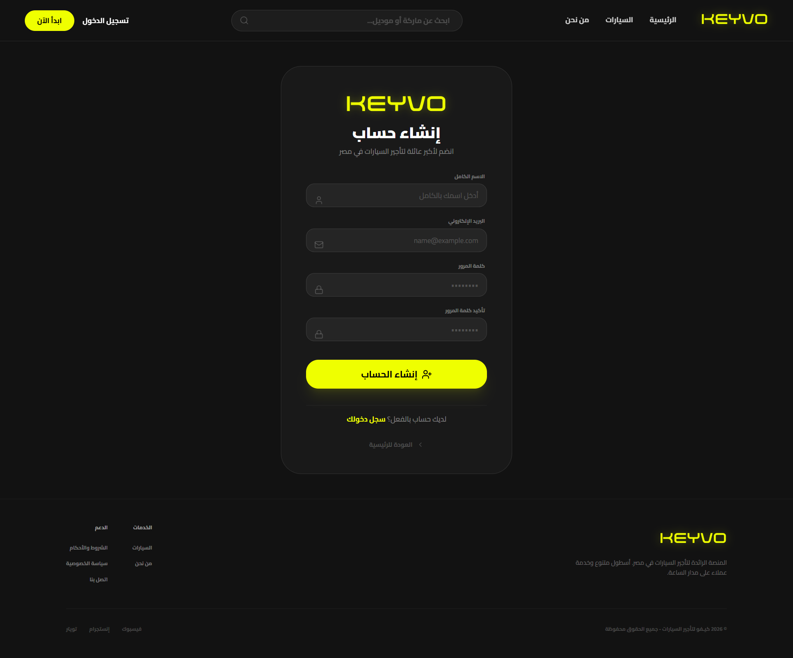
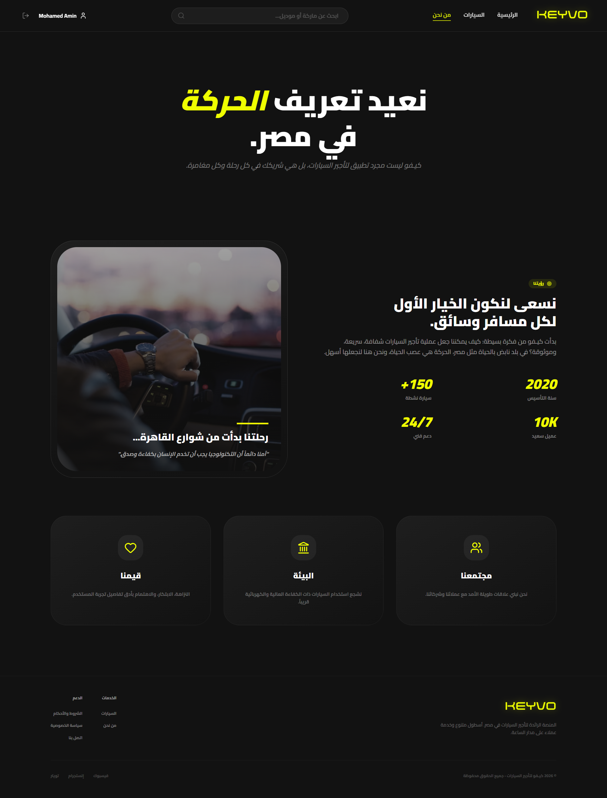

# KEYVO Car Rental Platform


Live Demo:
[keyvo-car-rental.vercel.app](keyvo-car-rental.vercel.app)

KEYVO is a modern car rental platform built with React, TypeScript, Redux Toolkit, and Tailwind CSS. The project focuses on a polished browsing experience, a full booking flow, and a simple account area for authentication and booking management.

## Overview

This project includes:

- A landing page with featured cars, brand highlights, and call-to-action sections
- A car catalog with filters and search
- A detailed vehicle page with specs, features, gallery, and location map
- A booking flow with date selection, pricing summary, payment, and confirmation
- Authentication pages for login and signup
- A profile page for viewing and managing bookings

## Tech Stack

- React 19
- TypeScript
- Vite
- Tailwind CSS
- Redux Toolkit
- React Router
- Formik + Yup
- Leaflet / React Leaflet
- Lucide React

## Main Pages

- `/` - Home
- `/cars` - Cars listing
- `/car/:id` - Car details
- `/booking/:id` - Booking
- `/payment/:id` - Payment
- `/confirmation` - Booking confirmation
- `/login` - Login
- `/signup` - Signup
- `/profile` - User profile
- `/about` - About

## Getting Started

### Prerequisites

- Node.js 18+
- npm

### Installation

```bash
npm install
```

### Run in Development

```bash
npm run dev
```

### Build for Production

```bash
npm run build
```

### Preview Production Build

```bash
npm run preview
```

## Available Scripts

- `npm run dev` starts the Vite development server
- `npm run build` creates the production build
- `npm run preview` previews the production build locally
- `npm run lint` runs TypeScript type-checking

## Project Structure

```text
src/
  components/
    booking/
    car/
    cardetails/
    cars/
    common/
    home/
    layout/
    ui/
  data/
  pages/
  store/
    features/
  utils/
```

## Highlights

- Reusable UI components for buttons, inputs, badges, and modals
- Global state management for vehicles, bookings, and authentication
- Filterable inventory experience with search support
- Booking flow with date validation and total price calculation
- Route-based navigation with scroll-to-top behavior
- Responsive layout across desktop and mobile screens


## Screenshots

### Home



### Cars



### Car Details



### Checkout



### Payment



### Completed Payment



### Dashboard



### Login



### Signup




### About


